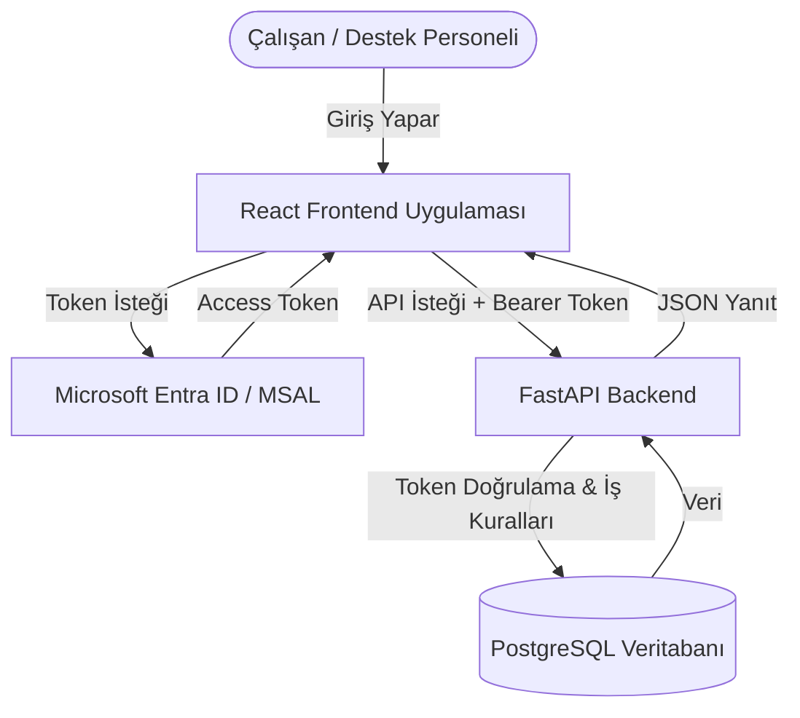

# Sistem Mimarisi (Architecture)

Corporate Helpdesk projesi, modern web uygulaması mimarisine uygun olarak **Frontend (İstemci)** ve **Backend (Sunucu)** olmak üzere iki ana katmandan oluşmaktadır. Ayrıca güvenlik için **Microsoft Identity Platform (Entra ID)** ve veri depolama için **PostgreSQL** kullanılmaktadır.

## 1. Yüksek Seviye Mimari Akışı

Sistemdeki temel istek ve veri akışı aşağıdaki gibidir:

## 2. Bileşenler ve Teknolojiler

### Frontend (Kullanıcı Arayüzü)
*   **Çatı (Framework):** React (Vite ile derlenecek).
*   **Dil:** TypeScript (Tip güvenliği için).
*   **Stil:** Tailwind CSS.
*   **Görev:** Kullanıcıların talepleri oluşturduğu, okuduğu ve güncellediği yerdir. Kullanıcı şifre girmez, MSAL kütüphanesi yardımıyla Microsoft şirket hesabıyla oturum açar ve bir Access Token alır.

### Backend (REST API)
*   **Çatı (Framework):** FastAPI (Python tabanlı, çok hızlı, asenkron ve modern bir API çatısı).
*   **Görev:** React'ten gelen HTTP isteklerini alır. İsteklerin başlığında (Header) bulunan Token'ı Microsoft üzerinden doğrular. Eğer yetki varsa (Örn: Sadece IT çalışanı bu talebi atayabilir) veritabanında gerekli işlemi yapar.

### Veritabanı (Database)
*   **Tür:** PostgreSQL (İlişkisel veritabanı).
*   **ORM:** SQLAlchemy 2.0 (Veritabanı işlemlerini Python sınıfları üzerinden yapmak için).
*   **Görev:** Kullanıcıların, taleplerin, departmanların ve yorumların kalıcı olarak saklandığı yerdir.

### Altyapı ve Dağıtım (DevOps)
*   **Konteynerizasyon:** Docker (Frontend, Backend ve Veritabanı ayrı container'larda çalışır).
*   **CI/CD:** GitHub Actions (Koda her güncelleme geldiğinde otomatik test yapar).
