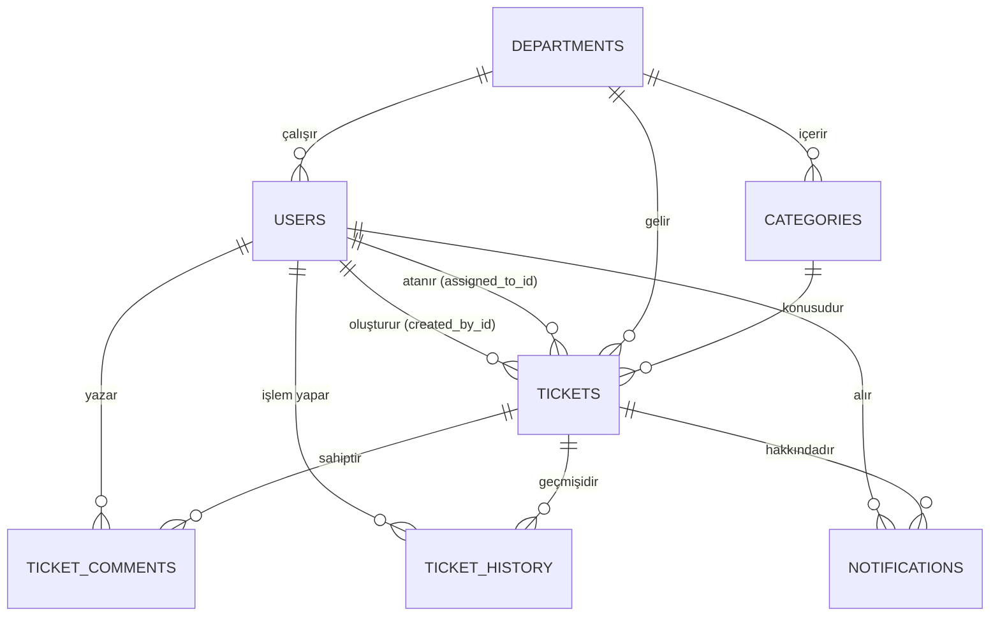

# Veritabanı Tasarımı (Database Design)

Bu belgede projenin veritabanı (PostgreSQL) tabloları, sütunları ve bu tablolar arasındaki ilişkiler tanımlanmıştır.

## 1. ER (Entity-Relationship) Diyagramı

## 2. Tablolar ve Sütunlar

### `users` (Kullanıcılar)
Sisteme giriş yapan herkesin (Çalışan, Destek Personeli, Admin) bilgilerini tutar.
*   `id` (PK)
*   `entra_object_id` (Microsoft'tan gelen benzersiz ID)
*   `email` (E-posta)
*   `full_name` (Ad Soyad)
*   `role` (Enum: ADMIN, SUPPORT_AGENT, EMPLOYEE)
*   `department_id` (FK - Hangi departmanda çalışıyor)
*   `is_active` (Aktif mi?)
*   `created_at` / `updated_at`

### `departments` (Departmanlar)
IT, İnsan Kaynakları, Finans gibi destek veren birimlerin listesi.
*   `id` (PK)
*   `name` (Örn: IT, HR)
*   `description` (Açıklama)
*   `is_active`
*   `created_at`

### `categories` (Kategoriler)
Her departmanın altındaki talep türleri (Örn: IT -> Donanım Arızası).
*   `id` (PK)
*   `name` (Kategori adı)
*   `department_id` (FK - Hangi departmana ait)
*   `default_priority` (Varsayılan öncelik seviyesi)
*   `is_active`
*   `created_at`

### `tickets` (Destek Talepleri)
Sistemin ana veri tablosudur. Açılan tüm kayıtlar burada tutulur.
*   `id` (PK)
*   `ticket_number` (Örn: TCK-2026-000001)
*   `title` (Başlık)
*   `description` (Detaylı açıklama)
*   `status` (Enum: OPEN, ASSIGNED, IN_PROGRESS, WAITING_FOR_USER, RESOLVED, CLOSED, CANCELLED)
*   `priority` (Enum: LOW, MEDIUM, HIGH, CRITICAL)
*   `category_id` (FK - Hangi konu)
*   `department_id` (FK - Hangi birime gidiyor)
*   `created_by_id` (FK - Talebi kim açtı)
*   `assigned_to_id` (FK - Hangi destek personeli ilgileniyor)
*   `created_at` / `updated_at` / `resolved_at` / `due_at`

### `ticket_comments` (Talep Yorumları)
Taleplere yazılan yazışmaları tutar.
*   `id` (PK)
*   `ticket_id` (FK - Hangi talep)
*   `user_id` (FK - Yorumu yazan)
*   `message` (Yorum içeriği)
*   `is_internal` (Boolean - Sadece destek personeli görebilir)
*   `created_at`

### `ticket_history` (İşlem Geçmişi / Audit)
Bir talepte yapılan her değişikliği (örneğin durumu değişti, birine atandı) kayıt altına alır.
*   `id` (PK)
*   `ticket_id` (FK)
*   `actor_user_id` (FK - İşlemi yapan kişi)
*   `action` (Enum: TICKET_CREATED, STATUS_CHANGED, PRIORITY_CHANGED, ASSIGNED, COMMENT_ADDED, vb.)
*   `old_value` (Eski Değer)
*   `new_value` (Yeni Değer)
*   `created_at`

### `notifications` (Bildirimler)
Sistem içi uyarıları barındırır.
*   `id` (PK)
*   `recipient_user_id` (FK - Bildirimi alacak kişi)
*   `ticket_id` (FK - Hangi talep ile ilgili)
*   `title` (Bildirim Başlığı)
*   `message` (Bildirim İçeriği)
*   `is_read` (Okundu mu?)
*   `created_at`
